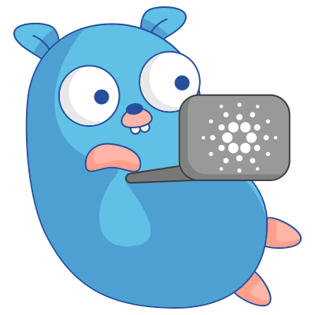

<a href="https://fivebinaries.com/"></a>

# go-cardano-serialization

<p align="center">Golang library for serialization &amp; deserialization of Cardano data structures.</a>
<br>

<p align="center">
  <a href="#quickstart">Quickstart</a> •
  <a href="#examples">Examples</a> •
  <a href="#tests">Testing</a>
</p>
<br>

## Quickstart
Make sure you are using Go 1.15+, and Go modules support is enabled.

Install or update `go-cardano-serialization` package commands with:
   
```console
$ go get github.com/fivebinaries/go-cardano-serialization
```

## Examples

An example of Cardano addresses serialization in Go.

```go
// load address from Base58
addr, err := FromBytes(base58.Decode("Ae2tdPwUPEZ4YjgvykNpoFeYUxoyhNj2kg8KfKWN2FizsSpLUPv68MpTVDo"))
if err != nil {
  log.Panic(err)
}
// get ByronAddress
byronAddr := addr.ToByronAddress()
// get protocol magic for Byron address
magic := byronAddr.ProtocolMagic() 
// get network ID for Byron address
netId := byronAddr.NetworkId() 
// create new base address
keyBytes := [crypto.Ed25519KeyHashLen]byte{}
scriptBytes := [crypto.ScriptHashLen]byte{}
for i := range keyBytes {
  keyBytes[i] = 23
}
for i := range scriptBytes {
  scriptBytes[i] = 42
}
addrBase := NewBaseAddress(5, StakeCredetialFromKeyHash(keyBytes[:]), StakeCredetialFromScriptHash(scriptBytes[:]))
addrBytes := addrBase.ToBytes()
```
   
## Tests
You can run all tests with the command:

```console
$ go test ./...
```
